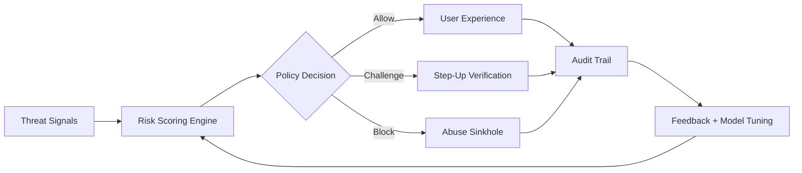

<!-- HEADER -->

  

<!-- TYPING ANIMATION -->

  

  

  

<!-- META BADGES -->

  
  &nbsp;
  
  &nbsp;
  
  &nbsp;
  
  &nbsp;
  
  &nbsp;
  

 

---

<!-- ABOUT -->

  

  I'm a software engineer who works at the edges — the parts of systems that break, get abused, or get ignored. 
  Security tooling, fraud detection, trust infrastructure, resilient backends, and things that have to work even when the internet doesn't cooperate.

  <em>Kenya-based. Thinking in distributed systems. Building for the real world.</em>

<table align="center"><tr><td align="center" width="760">
 
&ldquo;<strong>The most dangerous assumption in software is that the happy path is the only path.</strong>&rdquo;
  
</td></tr></table>

 

<!-- ENGINEERING PRINCIPLES -->
<table align="center" width="780">
  <tr>
    <td align="center" width="260">
      <strong>🎯 Security by Design</strong> 
      Not a feature — a foundation. Threat model first, build second.
    </td>
    <td align="center" width="260">
      <strong>📡 Observe Everything</strong> 
      If it can fail silently, it will. Instrument before you need it.
    </td>
    <td align="center" width="260">
      <strong>⚡ Resilience as Default</strong> 
      Happy paths are easy. Edge cases are where real systems live.
    </td>
  </tr>
</table>

 

<table align="center" width="820">
  <tr>
    <td align="center" width="205">
      <strong>🧭 Focus</strong> 
      I work best where trust, speed, and failure modes all collide.
    </td>
    <td align="center" width="205">
      <strong>📉 Risk</strong> 
      I like systems that explain why they blocked, challenged, or allowed.
    </td>
    <td align="center" width="205">
      <strong>🧱 Infrastructure</strong> 
      Backends should be observable, auditable, and boring in production.
    </td>
    <td align="center" width="205">
      <strong>⚙️ Delivery</strong> 
      I optimize for small loops, clear decisions, and production reality.
    </td>
  </tr>
</table>

 

---

<!-- WHAT I BUILD -->

  

| 🔐 Security & Trust | 💸 FinTech & Fraud | 🌐 Protocols & Networks | 🤖 AI & Automation |
|:---|:---|:---|:---|
| Tamper-proof audit logs | Mobile money fraud detection | Human-readable binary protocols | AI security assistants |
| API abuse classification | Fraud-forensics-as-a-service | Executable network packets | Intelligent automation pipelines |
| Zero-trust local networks | Real-time anomaly detection | Deterministic distributed execution | LLM-powered backend agents |
| Secure key management | Risk scoring engines | Custom packet formats | Data extraction & enrichment |

 

---

<!-- CURRENTLY BUILDING -->

  

| Project | What's Cooking | Status |
|:---|:---|:---:|
| 🔭 **Fraud Intelligence Platform** | Real-time scoring · Explainable signals · Audit trail |  |
| 🛡️ **Cybersecurity Tooling** | Threat detection · Alerting · Forensic log pipelines |  |
| 🔗 **Protocol Experiments** | Binary formats · Deterministic P2P execution |  |
| 🤖 **AI-Powered Backend Agents** | LLM orchestration · Tool use · Secure sandboxing |  |

 

---

<!-- PINNED PROJECTS -->

  

<table align="center" width="820">
  <tr>
    <td width="400" valign="top">
      <h3>🛡️ Fraud Intelligence Platform</h3>
      
End-to-end fraud detection system with real-time risk scoring, explainable signals, and a full audit trail. Built for mobile money environments where signal noise is high and latency tolerance is near zero.

      

        
        
        
        
      

      📡 Real-time · 🔍 Explainable AI · 🔒 Tamper-proof logs
    </td>
    <td width="400" valign="top">
      <h3>🔐 Trust Mesh — Zero-Trust Local Network</h3>
      
Mutual-auth overlay for local networks. Every node presents a signed certificate, traffic is encrypted in-transit, and policy violations generate forensic-grade events — no central broker required.

      

        
        
        
        
      

      🌐 Zero-trust · 📜 PKI · 🛰️ Distributed policy engine
    </td>
  </tr>
  <tr>
    <td width="400" valign="top">
      <h3>📦 Protocol Forge</h3>
      
Toolkit for defining, parsing, and generating binary network protocols from declarative schemas. Produces human-readable packet descriptions, fuzz harnesses, and Wireshark dissectors automatically.

      

        
        
        
      

      🔧 Parser combinators · 📡 Network layers · 🔬 Fuzz-ready
    </td>
    <td width="400" valign="top">
      <h3>🤖 Secure Agent Sandbox</h3>
      
LLM orchestration runtime with hard tool-call limits, sandboxed execution contexts, and cryptographically signed operation logs. Designed for autonomous backend agents that can't be trusted blindly.

      

        
        
        
        
      

      🧠 LLM agents · 🔒 Sandboxed exec · 📋 Audit-first
    </td>
  </tr>
</table>

 

---

<!-- STACK -->

  

  <strong>Languages</strong>  
  

  <strong>Frameworks &amp; Libraries</strong>  
  

  <strong>Data, Infrastructure &amp; Cloud</strong>  
  

  <strong>Security, Observability &amp; Platforms</strong>  
  

 

---

<!-- ON MY RADAR -->

  

  <em>Technologies I'm actively exploring or keeping a close eye on:</em>

  

  

 

---

<!-- SYSTEM THINKING MAP -->

  

  <em>From detection to action to learning — closed-loop trust systems.</em>

<table align="center" width="820">
  <tr>
    <td align="center" width="205"><strong>1) Sense</strong> Capture weak signals early</td>
    <td align="center" width="205"><strong>2) Decide</strong> Apply transparent risk policies</td>
    <td align="center" width="205"><strong>3) Respond</strong> Protect without breaking UX</td>
    <td align="center" width="205"><strong>4) Learn</strong> Continuously improve models</td>
  </tr>
</table>

 

---

<!-- STATS -->

  

  

  
  &nbsp;
  

  

  

  

  
  &nbsp;
  

 

---

<!-- SNAKE -->

  

  <picture>
    <source media="(prefers-color-scheme: dark)" srcset="https://raw.githubusercontent.com/DANIELKILONZI/DANIELKILONZI/output/github-snake-dark.svg"/>
    <source media="(prefers-color-scheme: light)" srcset="https://raw.githubusercontent.com/DANIELKILONZI/DANIELKILONZI/output/github-snake.svg"/>
    
  </picture>

 

---

<!-- ASK ME ABOUT -->

  

<table align="center" width="820">
  <tr>
    <td align="center" width="273">
      <strong>🔐 Applied Security</strong> 
      Threat modeling, auditability, credential boundaries, abuse resistance, and secure defaults that survive contact with production.
    </td>
    <td align="center" width="273">
      <strong>💸 Fraud &amp; Trust Systems</strong> 
      Risk scoring, explainable fraud signals, event pipelines, policy engines, and how to reduce loss without destroying user experience.
    </td>
    <td align="center" width="273">
      <strong>🤖 Agentic Backends</strong> 
      Tool-using LLM systems, sandboxed execution, permission boundaries, traceability, and keeping automation useful under real constraints.
    </td>
  </tr>
</table>

  Good conversation starters: protocol design, resilient APIs, observability, postmortems, and the weird bugs that only happen at scale.

 

---

<!-- HOW I WORK -->

  

<table align="center" width="820">
  <tr>
    <td align="center" width="205">
      <strong>🗺️ Map First</strong> 
      Understand the problem space before writing a single line. Diagrams and threat models before code.
    </td>
    <td align="center" width="205">
      <strong>🔬 Small, Fast Loops</strong> 
      Ship something verifiable. Iterate tightly. Avoid big-bang integrations wherever possible.
    </td>
    <td align="center" width="205">
      <strong>📢 Explicit Over Implicit</strong> 
      Prefer clear contracts, typed interfaces, and obvious failure modes over clever magic.
    </td>
    <td align="center" width="205">
      <strong>🤝 Context-First Reviews</strong> 
      Good code review starts with understanding the intent — not hunting for syntax.
    </td>
  </tr>
</table>

 

---

<!-- LEARNING PHILOSOPHY -->

  

  

 

---

<!-- OPEN SOURCE & COMMUNITY -->

  

  <em>Open source isn't just about shipping code — it's about trust at scale.</em>

<table align="center" width="820">
  <tr>
    <td align="center" width="273">
      <strong>🐛 Bug Reports</strong> 
      Clear reproduction steps save more time than a 500-line PR without context.
    </td>
    <td align="center" width="273">
      <strong>📝 Documentation</strong> 
      Good docs are load-bearing. Treat them as first-class code.
    </td>
    <td align="center" width="273">
      <strong>🔍 Security Disclosures</strong> 
      Always prefer coordinated disclosure. Fix the ecosystem, not just your repo.
    </td>
  </tr>
</table>

 

---

<!-- OUTSIDE THE TERMINAL -->

  

<table align="center" width="820">
  <tr>
    <td align="center" width="164">
      <strong>📚 Reading</strong>  
      Security engineering papers, distributed systems research, and the occasional philosophy of mind rabbit hole
    </td>
    <td align="center" width="164">
      <strong>♟️ Chess</strong>  
      Positional player. Losing to engines since forever. The endgame is always the honest part
    </td>
    <td align="center" width="164">
      <strong>🏙️ Nairobi</strong>  
      Wired in from EAT (GMT+3). Shipping things while the rest of the world is still asleep
    </td>
    <td align="center" width="164">
      <strong>🔧 Hardware Tinkering</strong>  
      Microcontrollers, custom PCBs, and things that blink. Software is more fun when it touches metal
    </td>
    <td align="center" width="164">
      <strong>🎵 Focus OS</strong>  
      Lo-fi when designing. Drum & bass when debugging. Silence when writing docs. It's a whole system
    </td>
  </tr>
</table>

 
  

 

---

<!-- COLLABORATION MODEL -->

  

<table align="center" width="820">
  <tr>
    <td align="center" width="273">
      <strong>1. Define the risk</strong> 
      Before architecture, we agree on what can fail, what matters most, and what cannot be compromised.
    </td>
    <td align="center" width="273">
      <strong>2. Ship the smallest real thing</strong> 
      I prefer thin slices with telemetry over impressive prototypes that teach nothing about production behavior.
    </td>
    <td align="center" width="273">
      <strong>3. Keep the system legible</strong> 
      Clear interfaces, explicit decisions, and incident-friendly designs beat cleverness every time.
    </td>
  </tr>
</table>

  Best fit: teams building high-trust products, hardening critical paths, or turning messy operational problems into calm systems.

 

---

<!-- FOOTER CTA -->

  

  I'm available for senior engineering roles, technical collaborations, and well-scoped consulting. 
  Especially interested in: <strong>fraud/risk infrastructure · security tooling · AI-backend systems · fintech at scale</strong>

  
  &nbsp;
  
  &nbsp;
  

  Response time: usually within 24 h · Preferred first contact: LinkedIn or Email · Open to async-first remote roles

 

  

